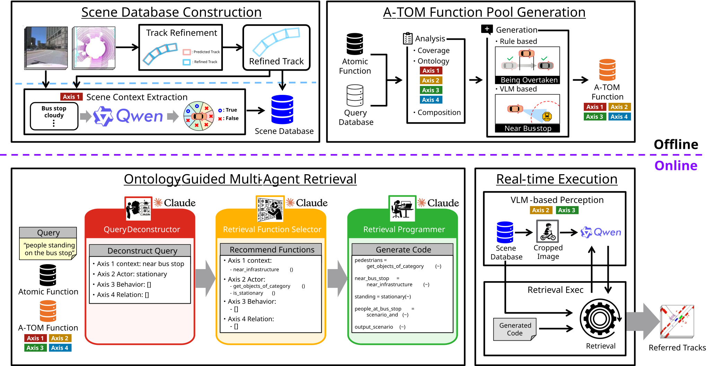

# HYU_OASIS

[](https://cvpr2026.wad.vision/)
[](https://eval.ai/web/challenges/challenge-page/2662/leaderboard/6908)
[](LICENSE)

> HYU's entry for the **Argoverse 2 Scenario Mining Challenge**, CVPR 2026
> [Workshop on Autonomous Driving (WAD)](https://cvpr2026.wad.vision/), Denver, Colorado.
> Built on [RefAV](https://arxiv.org/pdf/2505.20981).
>
> 🥇 **1st place**, Spatiotemporal Track\
> 🏅 **Innovation Award**
>
> **Hanyang University**, Department of Automotive Engineering

---

## Overview

The challenge casts scenario mining as natural-language-to-code: an LLM converts each query (e.g.
*"a pedestrian crossing in front of a turning vehicle"*) into a script of predefined atomic functions,
run over 3D tracks to retrieve the matching moments.

This paradigm has four weaknesses: the fixed atomic-function set covers only **71.7%** of evaluation
prompts; code generation hallucinates; code cannot express visual attributes (weather, emergency
vehicles); and noisy offline-perception trajectories inflate behavioral false positives. The first
three stem from a single LLM that ignores prompt structure and must encode every condition as code.

OASIS makes the prompt ontology explicit and routes each sub-condition to the most suitable tool. It
decomposes every query along four axes — **Context, Road Actor, Behavior, Relation** — and handles
each with:

| Component | Role |
|---|---|
| Three Claude agents | progressively narrow the function search space to suppress hallucination |
| Augmented atomic-function pool (A-TOM) | raises prompt coverage **71.7% → ~96%** |
| Vision-language model (Qwen3.6) | supplies annotation-absent visual attributes, offline and online|
| IMM smoother | refines noisy 3D trajectories, cutting behavioral false positives |



## Results

Argoverse 2 Scenario Mining Challenge, Spatiotemporal Track (test split) —
[official leaderboard](https://eval.ai/web/challenges/challenge-page/2662/leaderboard/6908):

| Metric | Baseline (RefProg) | HYU_OASIS | Δ |
|---|---|---|---|
| HOTA-Temporal | 26.27 | **38.50** | **+12.23** |
| HOTA-Track | 36.18 | **52.63** | **+16.45** |
| Timestamp BA | 68.07 | **74.32** | **+6.25** |
| Log BA | 70.46 | **77.12** | **+6.66** |

**1st of 64 teams**, 1000+ submissions.

## Installation

Python 3.10 (Conda recommended):

```bash
conda create -n oasis python=3.10 && conda activate oasis
pip install -r requirements.txt
export PYTHONPATH=.
```

`vllm` is not in `requirements.txt` — the vLLM tools ship their own container. Baseline-specific
extras are commented at the bottom of `requirements.txt`. Tested on Python 3.10 / torch 2.10 / CUDA 12.8.

## Dataset

The AV2 sensor dataset and RefAV annotations go where [refAV/paths.py](refAV/paths.py) expects them;
download or symlink into those locations.

```bash
conda install s5cmd -c conda-forge

# AV2 sensor dataset  ->  data/datasets/sensor
s5cmd --no-sign-request cp "s3://argoverse/datasets/av2/sensor/*" data/datasets/sensor

# RefAV scenario-mining annotations  ->  scenario_mining_downloads
hf download CainanD/RefAV --repo-type dataset --local-dir scenario_mining_downloads
```

Detector/tracker outputs go in `tracker_downloads` (see [LT3D](https://github.com/neeharperi/LT3D),
or use precomputed tracks). Pipeline outputs are written under `output/`.

## Usage

**1. Base detections/tracks (input).** Place per-log `sm_annotations.feather` under
`output/tracker_predictions/<base>/<split>/<log>/` (e.g. `<base> = Le3DE2E_Tracking`).

**2. Tracking — re-tracking + smoothing.** One command runs all four stages (ego offset → yaw-fix →
IMM re-tracking → IMM/RTS smoothing):

```bash
bash tools/scripts/run_imm_smoothing.sh
```

The final smoothed dir `output/tracker_predictions/<SMOOTH>/` is what you point `tracker` at in
step 5. (Requires `tracking.motion_model: imm`; the script checks it.)

**3. Scene context.** Runs in the vLLM container (annotate → postprocess → validate); produces the
per-frame context labels read by the context atomics (e.g. `near_infrastructure`):

```bash
bash tools/scene_context_extraction/docker/run_container.sh      # on the host; rest runs inside
bash tools/scripts/run_scene_context_extraction.sh              # whole split → output/scene_context/<split>_processed/
```

**4. VLM server.** Serves the per-object vision-language classifier behind `get_visual_actor` /
`get_visual_behavior`. One vLLM replica per GPU; leave it running during eval:

```bash
CKPT=/path/to/weights bash tools/scripts/run_vlm_server.sh       # start + health-check
export REFAV_VLM_ENDPOINTS=http://localhost:8000,http://localhost:8001,...
export REFAV_VLM_MODEL=qwen3.6-35b
```

**5. Eval.** Add an entry to
[run/experiment_configs/experiments.yml](run/experiment_configs/experiments.yml) (copy the
commented template) pointing `tracker` at the step-2 dir and `LLM` at your scenario-code dir, then:

```bash
python run/run_experiment.py --exp_name <your_experiment>        # results -> output/sm_predictions/<name>/
```

## Repository layout

OASIS's additions are `tools/` and the agentic / vision-language atomic functions; `refAV/`, `run/`,
and `baselines/` are from RefAV. Annotations below mark the OASIS-specific parts. Data and I/O dirs
(`data/`, `scenario_mining_downloads/`, `tracker_downloads/`, `output/`) hold symlinks or gitignored
runtime output.

```
HYU_OASIS/
│
├── baselines/                          RefAV reference methods (black_box, groundingSAM, CLIP, ReferGPT)
│
├── data/datasets/                      AV2 sensor dataset (symlink)
│
├── output/                             predictions, eval results, caches
│
├── refAV/                              scenario-mining library (RefAV)
│   ├── atomic_functions.py             OASIS · augmented atomic-function pool + get_visual_* / context atoms
│   ├── code_generation.py
│   ├── dataset_conversion.py
│   ├── eval.py
│   ├── multi_agent.py                  OASIS · multi-agent (3-agent) scenario code generation
│   ├── parallel_scenario_prediction.py
│   ├── paths.py
│   ├── utils.py
│   └── visualization.py
│
├── run/                                experiment entry points (RefAV)
│   ├── experiment_configs/             experiments.yml (config + template)
│   ├── llm_prompting/
│   ├── nuprompt_conversion/
│   └── run_experiment.py
│
├── scenario_mining_downloads/          RefAV annotations & log/prompt pairs (symlink)
│
├── tools/                              OASIS preprocessing & perception toolchain (each subdir has its own README)
│   ├── multi_class_tracking/           IMM multi-class re-tracking
│   ├── rts_smoothing/                  IMM / RTS track smoothing + ego/yaw correction
│   ├── scene_context_extraction/       vLLM scene-context annotator (containerized)
│   ├── scripts/                        one-command pipeline runners (run_*.sh)
│   └── vlm_server/                     per-object vision-language classifier server (get_visual_*)
│
└── tracker_downloads/                  detector/tracker outputs
```

## Team

HYU OASIS — Department of Automotive Engineering, Hanyang University.

- Jeongwoo Park
- Yuseung Na
- Seongjae Jeong
- Minwon Lee

Advisor: Prof. Kichun Jo.

Thanks to the Argoverse 2 Scenario Mining Challenge organizers, and to Uber for sponsoring the prizes.

## License & citation

MIT ([LICENSE](LICENSE)). Built on RefAV:

```bibtex
@article{refav2025,
  title  = {RefAV: Towards Planning-Centric Scenario Mining},
  author = {Davidson, Cainan and others},
  journal= {arXiv preprint arXiv:2505.20981},
  year   = {2025}
}
```
